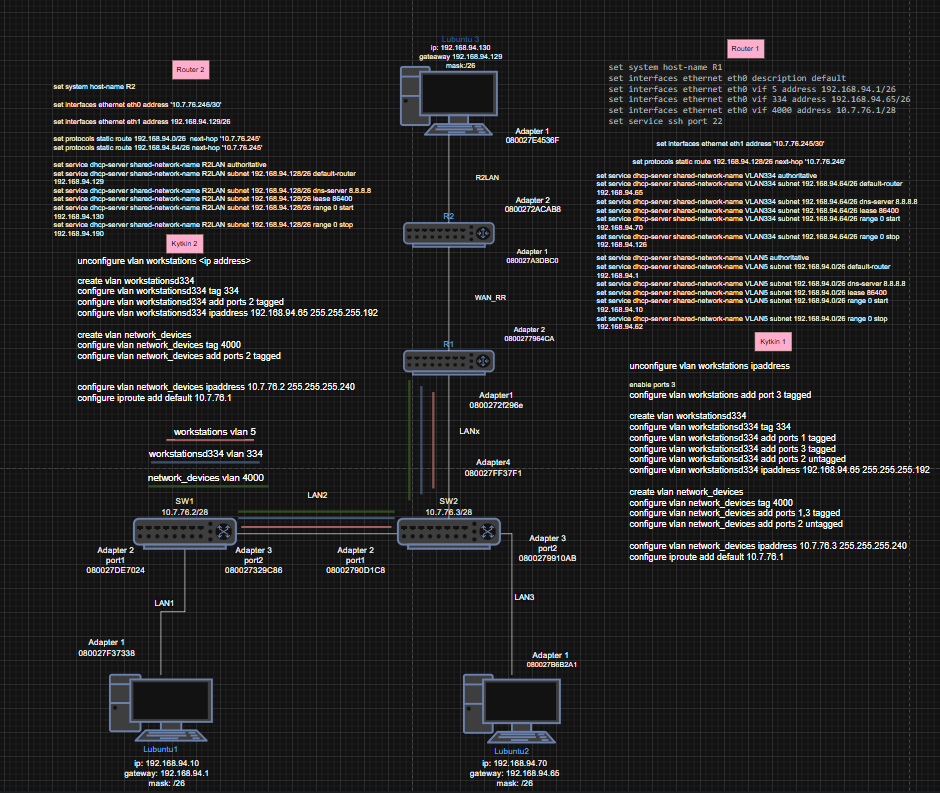
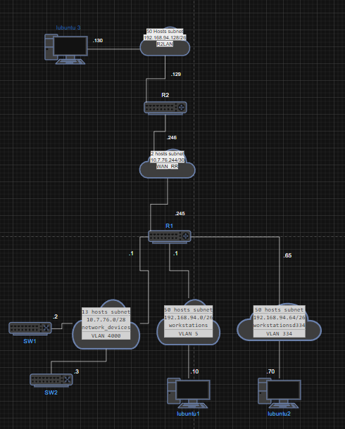
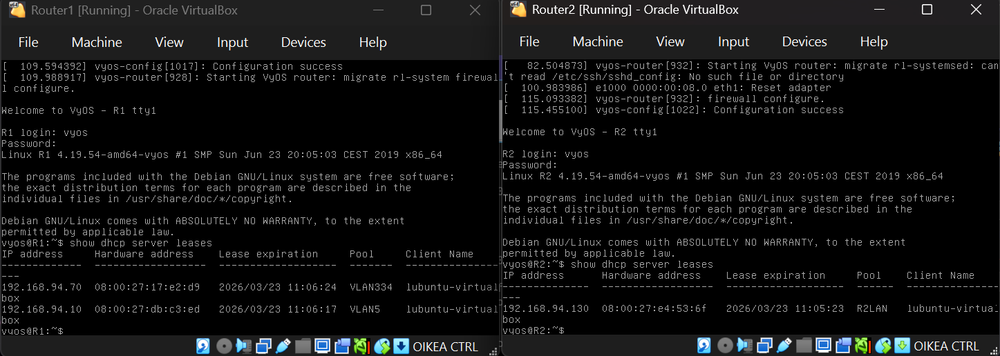
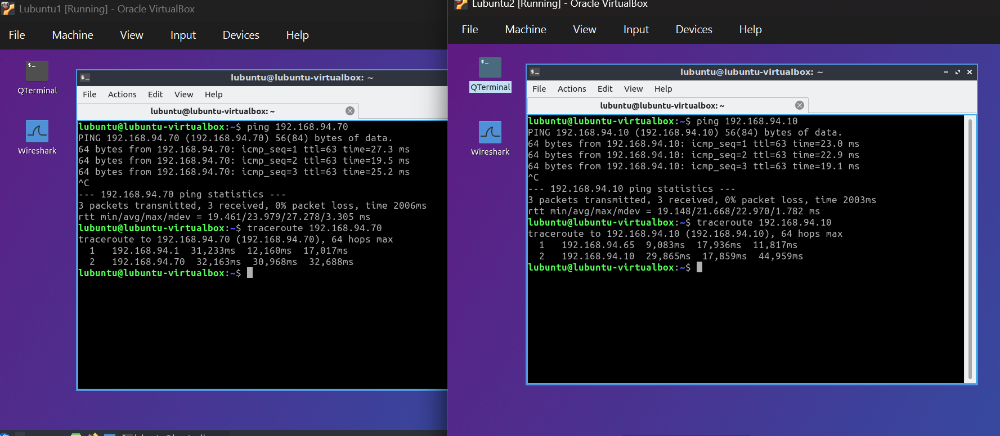
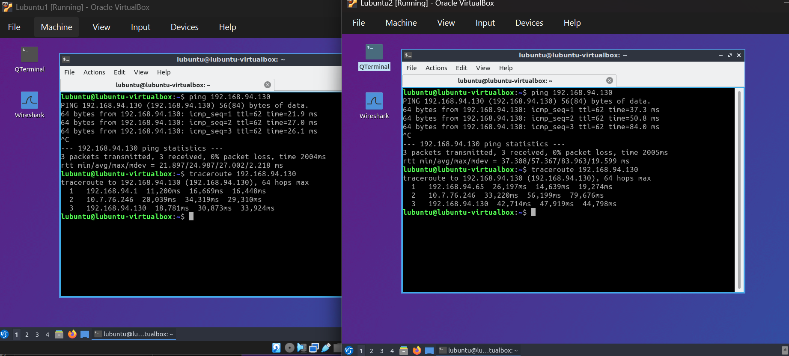
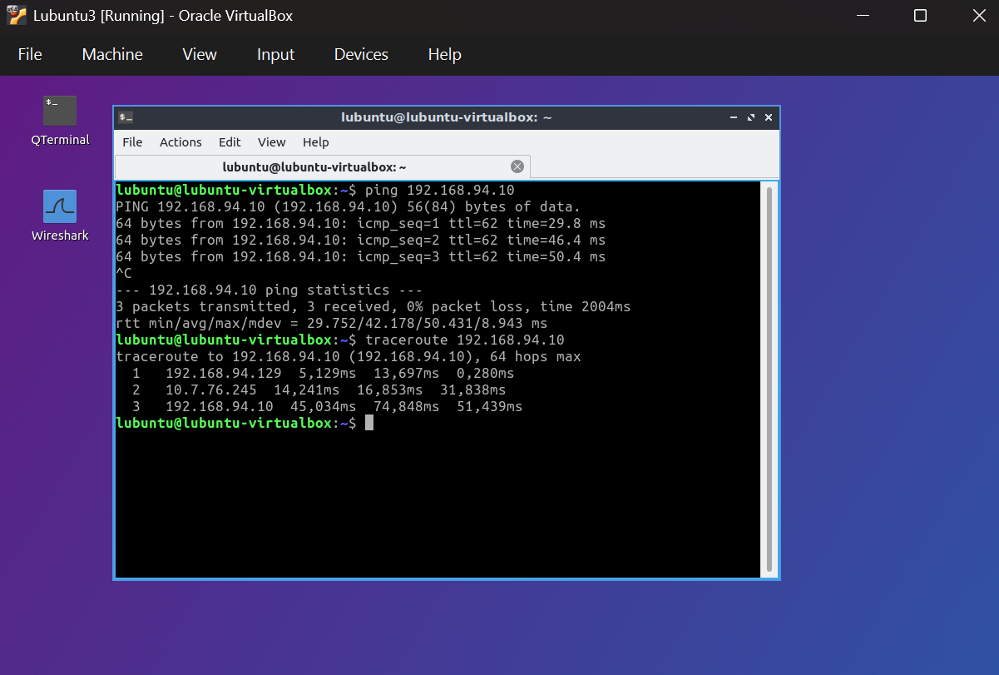
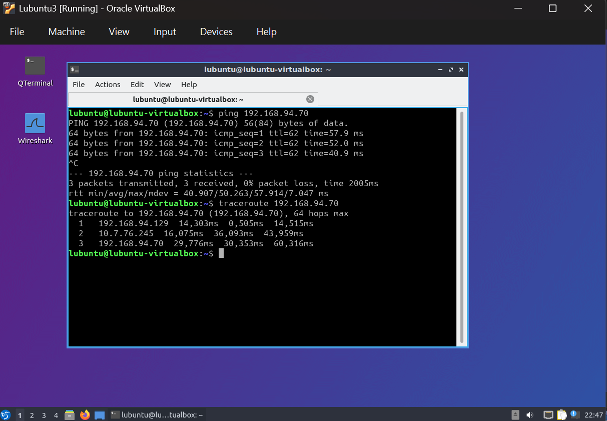

# VYOS DHCP ja staattinen reititys Lab

## Yleiskuvaus

Tässä projektissa toteutettiin useasta aliverkosta ja VLAN verkosta koostuva laboratorioympäristö käyttäen VYOS reitittimiä, kytkimiä ja Lubuntu-työasemia.

Projektissa yhdistettiin seuraavat verkkotekniikat:

* VLAN segmentointi
* DHCP palvelut useille aliverkoille
* Staattinen reititys
* Router on a Stick
* VYOS reitittimien konfigurointi
* Verkon toimivuuden todentaminen ping- ja traceroute-testeillä

## Topologiat

Fyysinen:



Looginen:



## Verkkorakenne

### R1

R1 toimii pääreitittimenä ja DHCP palvelimena kolmelle eri VLAN-verkolle:

| VLAN      | Verkko           | Käyttötarkoitus                 |
| --------- | ---------------- | ------------------------------- |
| VLAN 5    | 192.168.94.0/26  | Työasemaverkko                  |
| VLAN 334  | 192.168.94.64/26 | Työasemaverkko                  |
| VLAN 4000 | 10.77.6.0/28     | Verkkolaitteiden hallintaverkko |

VLAN-verkot toteutettiin käyttäen VYOS:in virtuaalisia rajapintoja (vif).

### R2

R2 tarjoaa yhteyden erilliseen työasemaverkkoon:

| Verkko            | Käyttötarkoitus |
| ----------------- | --------------- |
| 192.168.94.128/26 | Työasemaverkko  |


R1 ja R2 yhdistettiin toisiinsa erillisellä /30 WAN-linkillä, joka toimii reitittimien välisenä P2P yhteytenä:

| R1-R2 Välinen aliverkko      | Aliverkon tiedot                  |
| ----------- | -----------                                        |
| Aliverkon osoite                         | 10.7.76.244           |
| Aliverkon maski                          | 255.255.255.252 (/30) |
| Käytettävien päätelaiteosoitteiden määrä | 2                     |
| Ensimmäinen käytettävä päätelaite osoite | 10.7.76.245           |
| Viimeinen käytettävä päätelaite osoite   | 10.7.76.246           |
| yleislähetysosoite                       | 10.7.76.247           |


## DHCP-palvelut

DHCP palvelut konfiguroitiin molemmille reitittimille.

### R1

DHCP poolit:

* VLAN 5
* VLAN 334

### R2

DHCP pooli:

* R2LAN

DHCP-palvelut jakavat automaattisesti:

* IP-osoitteet
* oletusyhdyskäytävän
* DNS-palvelimet

Toimivuus varmennettiin tarkastelemalla DHCP-lainoja.

Komento:

```bash
show dhcp server leases
```



## Staattinen reititys

Verkkojen välinen liikenne mahdollistettiin symmetrisillä staattisilla reiteillä.

### R1

Tuntee R2:n työasemaverkon:

```bash
set protocols static route 192.168.94.128/26 next-hop 10.77.6.245
```

### R2

Tuntee R1:n VLAN-verkot:

```bash
set protocols static route 192.168.94.0/26 next-hop 10.77.6.245
set protocols static route 192.168.94.64/26 next-hop 10.77.6.245
```

## Testaus

Projektin toiminta varmennettiin seuraavilla testeillä:

### DHCP

* Työasemat saivat osoitteet automaattisesti
* Oletusyhdyskäytävät määrittyivät oikein
* DHCP-lainat näkyivät palvelimilla

## Pingit ja Traceroutet

Verkon toimivuuden varmistin pingeillä ja Tracerouteilla Työasemien välillä.









## konfiguraatiot

* [Reititin 1](konfiguraatiot/VYOSR1.cfg)

* [Reititin 2](konfiguraatiot/VYOSR2.cfg)

* [Kytkin 1](konfiguraatiot/SW1.cfg)

* [Kytkin 2](konfiguraatiot/SW2.cfg)

## Käytetyt teknologiat

* VYOS
* VirtualBox
* VLAN
* DHCP
* Static Routing
* IPV4
* ICMP
* Traceroute

## Mitä opin

Projektin aikana harjoittelin:

* aliverkkojen suunnittelua
* VLAN-verkkojen toteutusta
* Router on a Stick konfigurointia
* DHCP palveluiden käyttöönottoa VYOS:issa
* Staattisten reittien määrittämistä
* Verkkovianmääritystä ping ja traceroute työkaluilla
